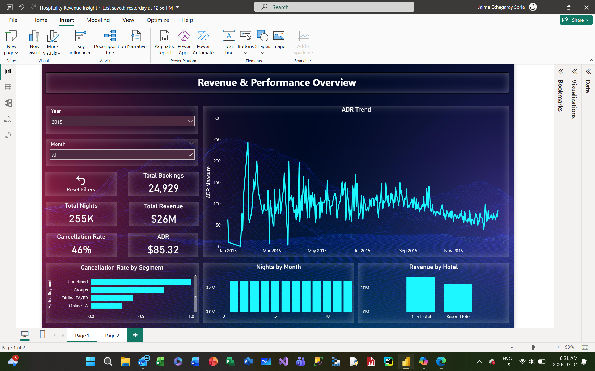
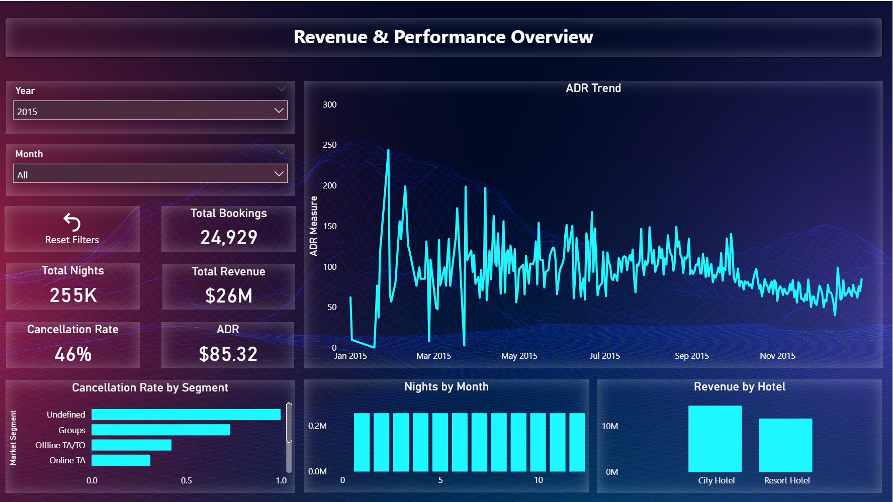

# **Hospitality Revenue & Guest Behavior Dashboard**  
*A two‑page Power BI project built using SQL, Power Query, data modeling, and DAX.*

---

## **Project Summary**

A complete hospitality analytics dashboard that connects **revenue performance** with **guest booking behavior**. Built end‑to‑end using SQL Server, Power BI, and DAX, this project turns raw hotel booking data into clear, actionable insights for revenue managers, operations teams, and hotel leadership.

---

## **📸 Dashboard Preview**

> Replace these with your actual images after uploading them into the `/images` folder.

  


---

## **1. Overview**

This project started with a simple idea: take a raw hotel booking dataset and turn it into something a real hotel manager could use — not just a pretty dashboard, but a tool that actually answers business questions.

I walked through the full BI workflow:

- exploring and cleaning data in SQL  
- shaping it in Power Query  
- building a clean data model  
- writing DAX that makes sense  
- designing visuals that tell a story  

The final result is a two‑page Power BI report that shows **how the hotel is performing** and **why it’s performing that way**.

---

## **2. Purpose of the Dashboard**

The dashboard answers two core questions:

### **1. How are we performing financially?**  
Revenue, ADR, cancellations, nights, seasonality, hotel comparison.

### **2. What are guests actually doing?**  
Lead time, length of stay, segment behavior, channel cancellations.

These insights support decisions around:

- pricing  
- forecasting  
- staffing  
- overbooking strategy  
- revenue optimization  

---

## **3. What Stakeholders Can Decide With This Dashboard**

This dashboard helps leadership:

- understand revenue trends and seasonality  
- identify high‑value and low‑value segments  
- spot cancellation risk by channel  
- see how far in advance guests book  
- understand how long guests stay  
- compare performance between hotels  
- improve forecasting accuracy  

It turns raw booking data into **clear, practical insight**.

---

## **4. Tools & Technologies**

- **SQL Server Management Studio (SSMS)** – data exploration and cleaning  
- **Power BI Desktop** – modeling, DAX, visualization  
- **Power Query** – shaping and transforming data  
- **DAX** – custom measures for revenue, ADR, cancellations, LOS, and lead time  

---

## **5. Data Preparation**

### **SQL Exploration & Cleaning**

I started by loading the dataset into SQL Server to understand its structure and quality.

Tasks included:

- checking for missing or inconsistent values  
- standardizing text fields  
- removing invalid rows (negative ADR, zero nights)  
- validating date ranges and booking statuses  

**Example SQL snippet**
```sql
SELECT *
FROM bookings
WHERE adr < 0
   OR (stays_in_week_nights + stays_in_weekend_nights) = 0;

---


